# Microsoft Azure Design and Implement a Storage Strategy

 
 
 
 
 
 
 
 
 
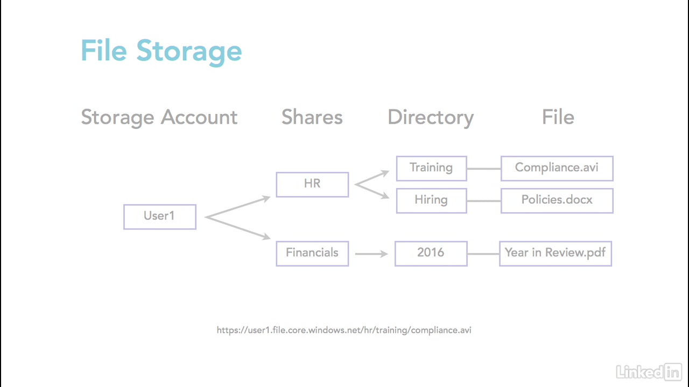 
 
 
 
 
 
 
 
 
 
 
 
 
 
 
 
 
 
 
 
 
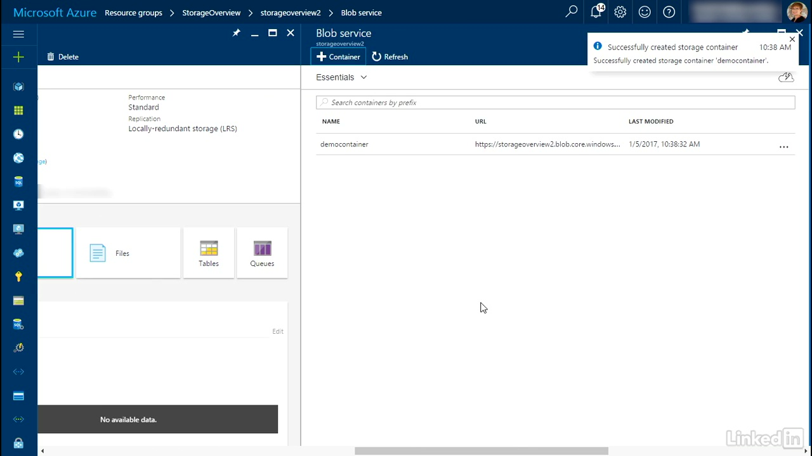 
 
 
 
 
 
 
 
 
 
 
 
 
 
 
 
 
 
 
 
 
 
 
 
 
 
 
 
 
 
 
 
 
 
 
 
 
 
 
 
 
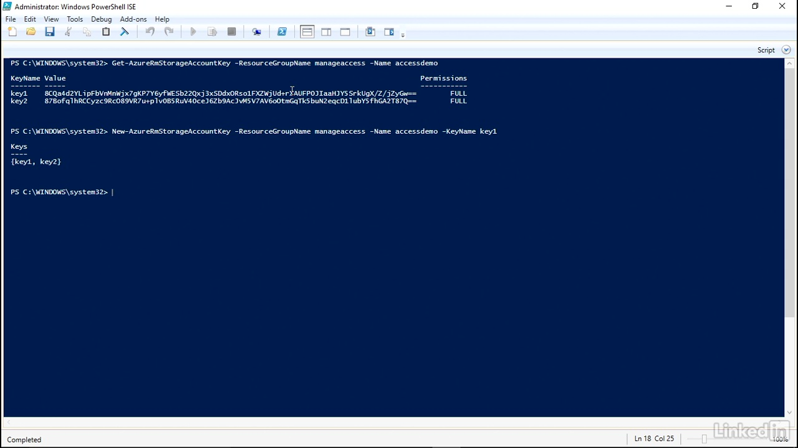 
 
 
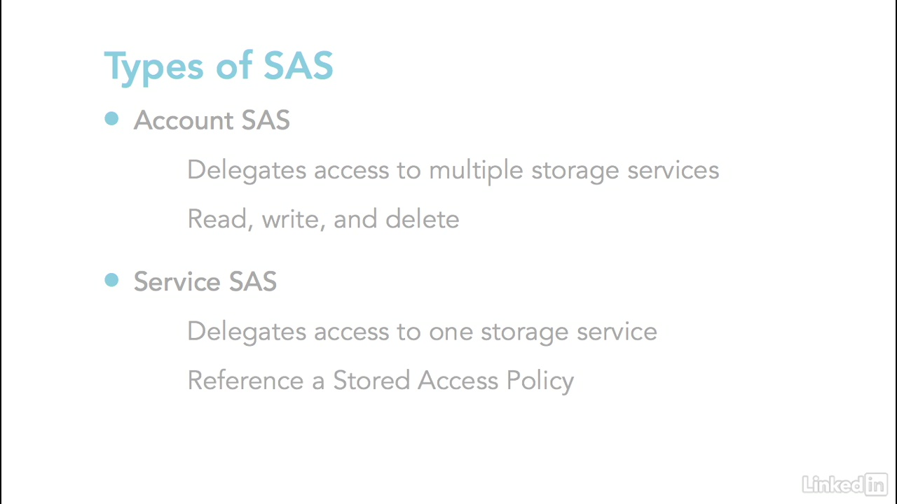 
 
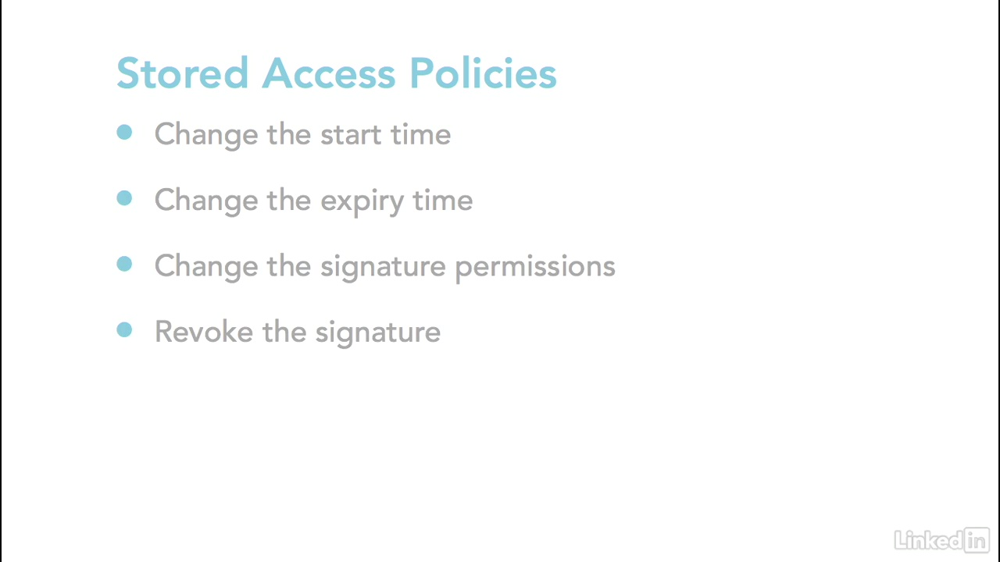 
 
 
 
 
 
 
 
 
 
 
 
 
 
 
 
 
 
 
 
 
 
 
 
 
 
 
 
 
 
 
 
 
 
 
 
 
 
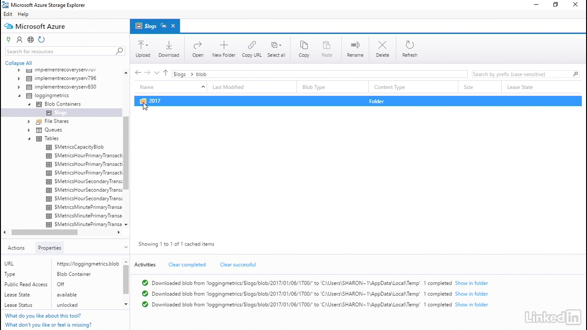 
 
 
 
 
 
 
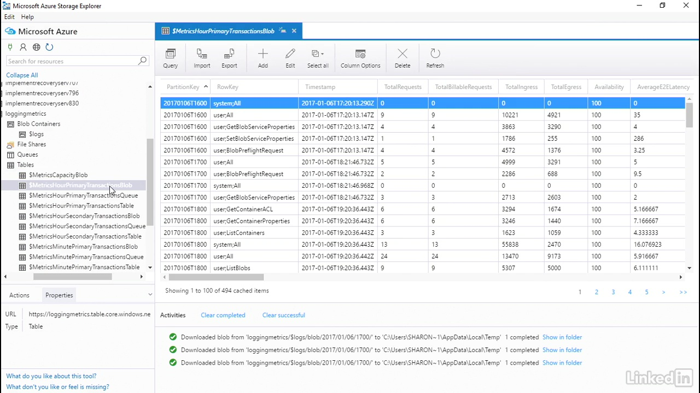 
 
 
 
 
 
 
 
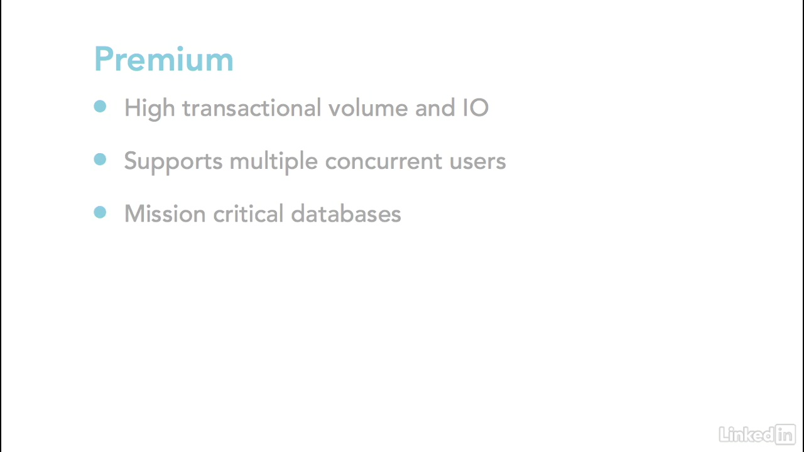 
 
 
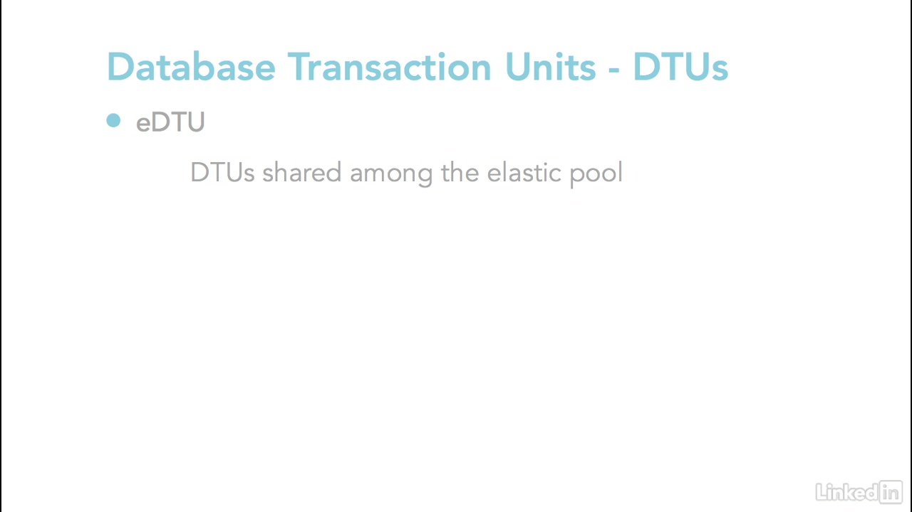 
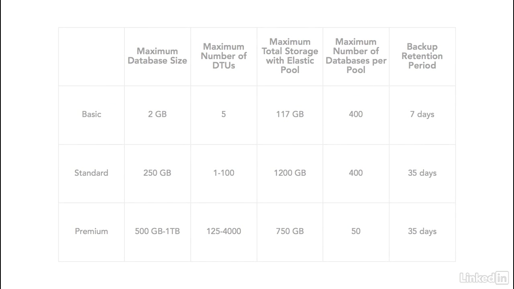 
 
 
 
 
 
 
 
 
 
 
 
 
 
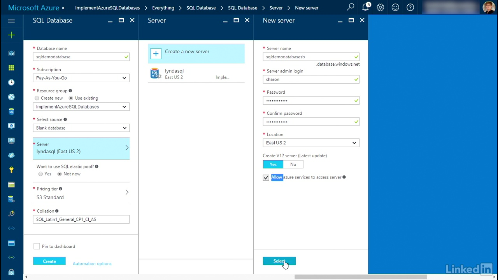 
 
 
 
 
 
 
 
 
 
 
 
 
 
 
 
 
 
 
 
 
 
 
 
 
 
 
 
 
 
 
 
 
 
 
 
 
 
 
 
 
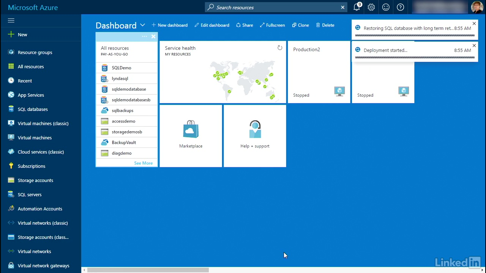 
 
 
 
 
 
 
 
 
 
 
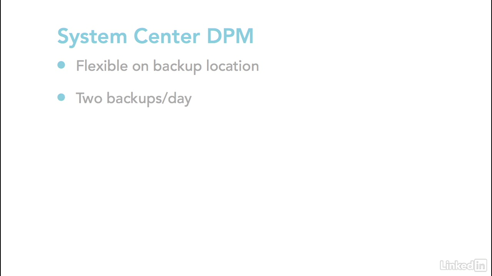 
 
 
 
 
 
 
 
 
 
 
 
 
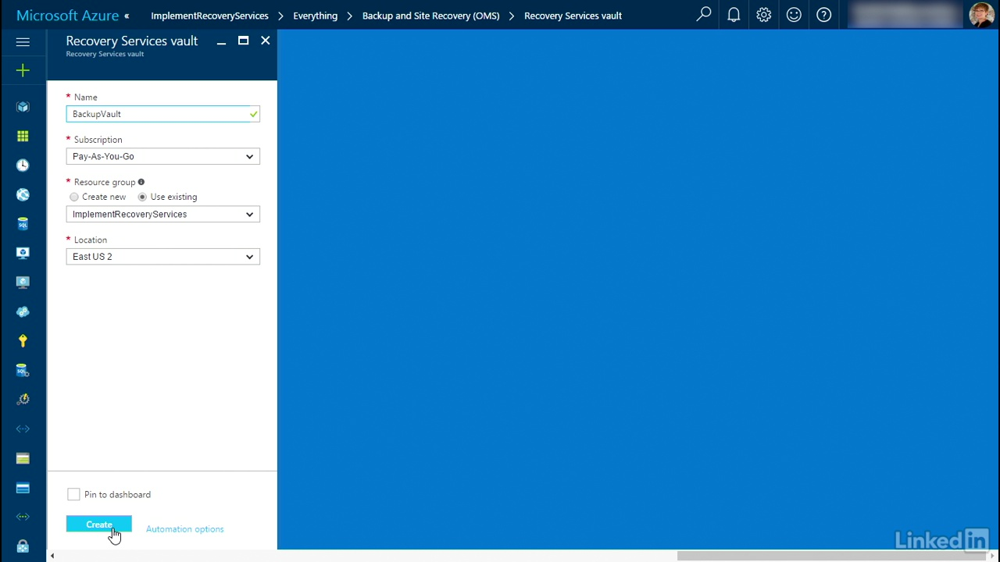 
 
 
 
 
 
 
 
 
 
 
 
 
 
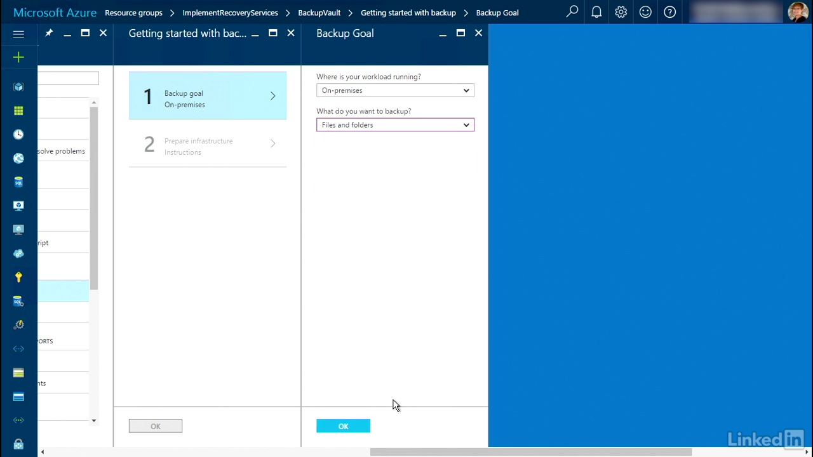 
 
 
 
 
 
 
 
 
 
 
 
 
 
 
 
 
 
 
 
 
 
 
 
 
 
 
 
 
 
 
 
 
 
 
 
 
 
 
 
 
 
 
 
 
 
 
 
 
 
 
 
 
 
 
 
 
 
 
 
 
 
 
 

### Microsoft Azure Storage Resources
  
+ [Azure Storage Explorer](https://azure.microsoft.com/en-us/features/storage-explorer/)
+ [Azure Table storage using .NET](https://docs.microsoft.com/en-us/azure/cosmos-db/table-storage-how-to-use-dotnet)
+ [Azure Queue storage using .NET](https://docs.microsoft.com/en-us/azure/storage/queues/storage-dotnet-how-to-use-queues)
+ [Azure SQL Database DTU calculator](http://dtucalculator.azurewebsites.net/)
+ [Azure SQL Database benchmark overview](https://docs.microsoft.com/en-us/azure/sql-database/sql-database-benchmark-overview)

