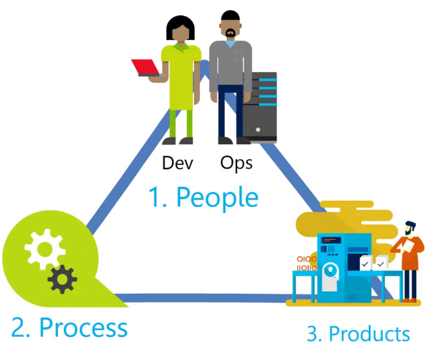
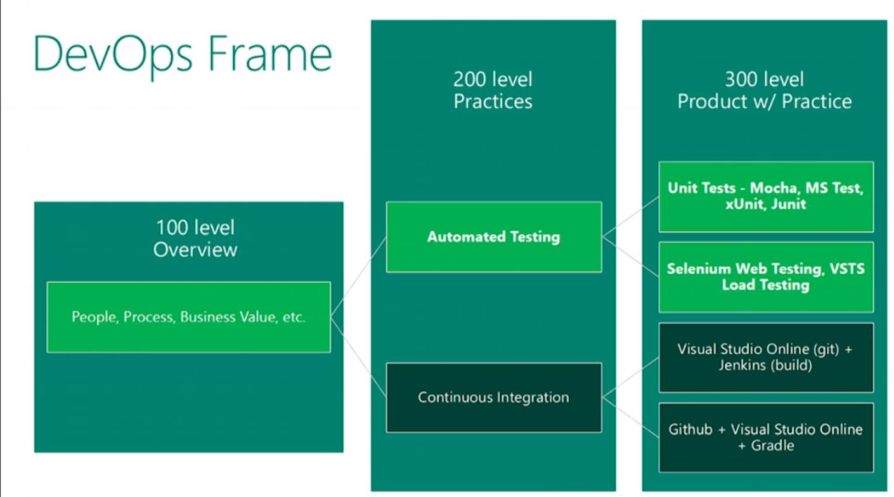
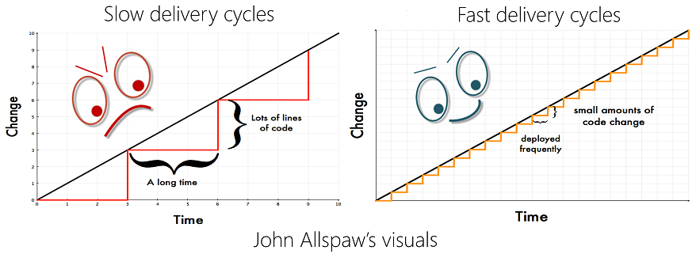
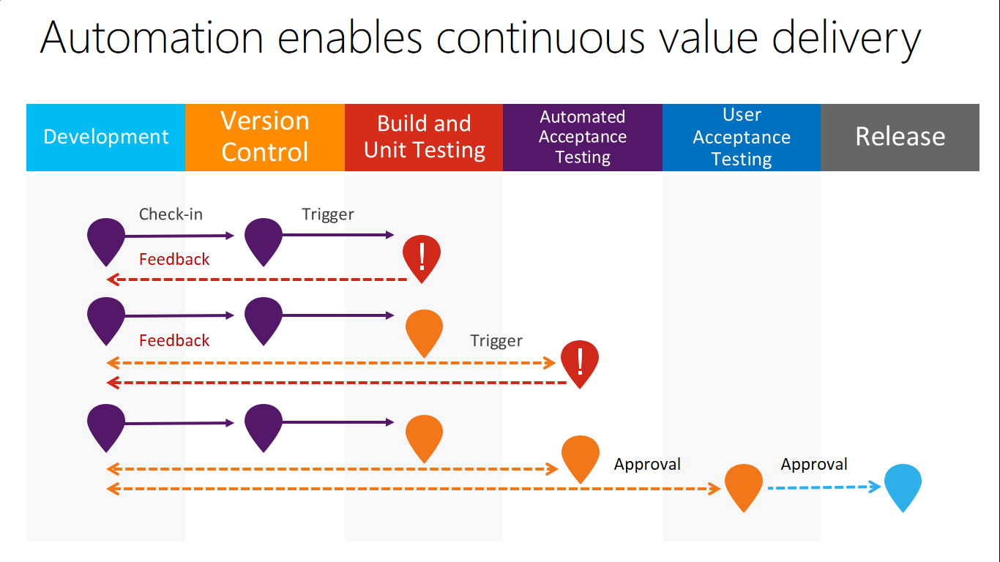
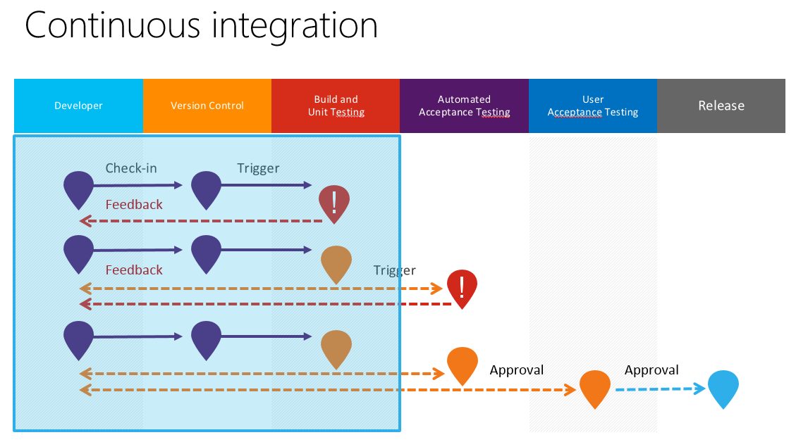
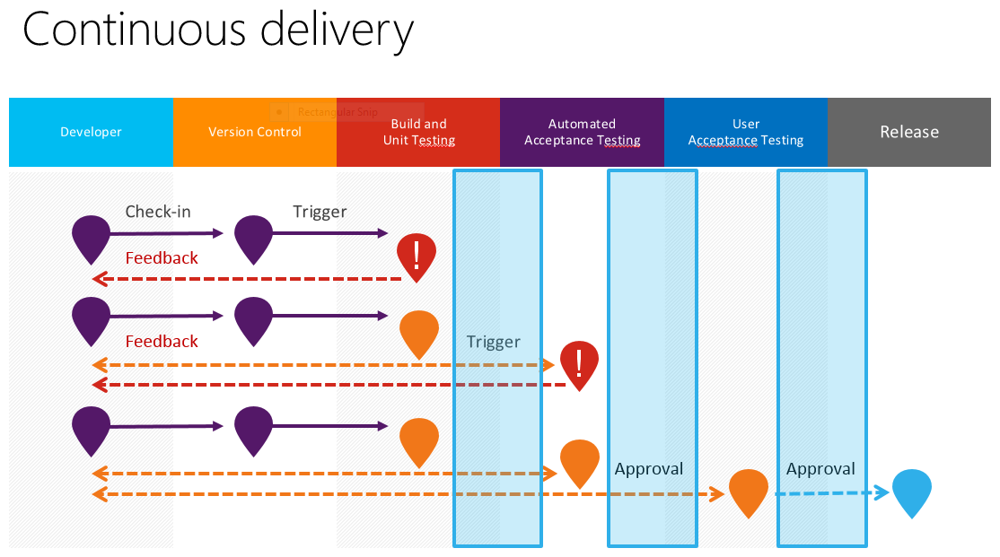
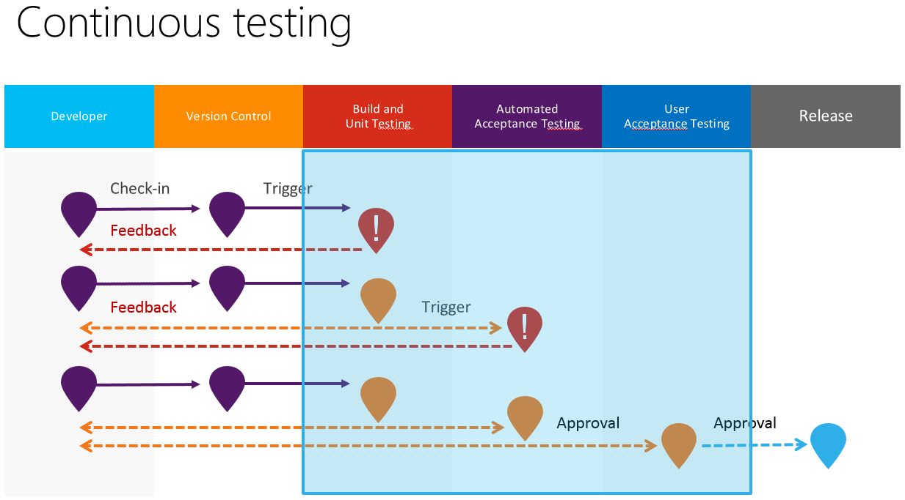

# Introduction to DevOps

## Course Description

DevOps is the union of people, process, and products to enable the continuous delivery of value to end users. It aims to create a culture and environment where building, testing, and releasing software can happen rapidly, frequently, and more reliably, so you can innovate like a startup and scale for the enterprise. 

By taking this introductory DevOps course, you’ll be able to define DevOps, understand why you need DevOps, and learn how you can get started with DevOps. You’ll learn the key ideas and techniques to bring development and operations together to produce higher-quality software and deliver it more quickly.

## Learning Objectives

After completing this course, we expect learners to:
+ Define DevOps and describe its value, history, and building blocks.
+ Describe how to unify processes and improve collaboration between development and operations.
+ Identify areas to consider when incorporating DevOps practice for continuous improvement.
+ Explain the key concepts and benefits of Continuous Integration (CI), continuous testing, and continuous deployment.
+ Identify tools and practices for implementing CI, testing, and continuous deployment.
+ Explain the key concepts and benefits of Release Management, configuration management, and monitoring in DevOps.
+ Identify tools and practices for implementing Release Management, configuration management, and monitoring. 

## Course Outline

***Week 1: Introduction to DevOps***
Introduction to the definition, value, history, building blocks, and best practices of DevOps

***Week 2: A unified process between development and operations***
Introduction to how Agile software development process applies to DevOps, the importance of integrating source control in DevOps, and how automation is applied to DevOps

***Week 3: Continuous Integration (CI), continuous testing, and continuous delivery***
Introduction to the key concepts, benefits, tools, and practices of implementing Continuous Integration (CI), continuous testing, and continuous delivery

***Week 4: Configuration management, release management, and monitoring and learning***
Introduction to the key concepts, benefits, tools and practices of implementing release management, configuration management, monitoring, and learning in DevOps.

## Prerequisites

This is an introductory DevOps course. It's for anyone who is involved in the development, delivery, or ongoing operations of software in an organization and interested in learning and adopting DevOps practice. 
It includes :
+ Experience working inside an organization that delivers software;
+ A basic understanding of source control and Agile software development process.

## Module 0: Start Here

### Course Overview

By taking this DevOps introductory course, you’ll be able to define DevOps, understand why you need DevOps, and how you can get started with DevOps; you’ll learn the key ideas and techniques to bring development and operations together to deliver software more quickly and produce higher-quality software.

## Module 1: Overview of DevOps

### Introduction

DevOps is a unit of people, process, and product to enable the continuous delivery of value to end users. Now let's use the following example to show you the differences between a traditional team and a DevOps team and how DevOps team is able to deliver value more frequently, rapidly, and reliably.

Here are two companies. One uses traditional software delivery process and the other embraces DevOps.
Both companies have an e-commerce website. A requirement comes in to add a new feature called `Customer Also Bought` to the check out experience.

In company A, analysts spend two weeks analyzing the requirements. They pass the document over to developers, who spend one month developing a feature. The developers hand off to testers who spend another week testing. Then testers pass on to the operations team who spend another week provisioning a new server before deploying the new bits. However, in the end, the new feature isn't quite delivering what the business wanted. Operations blame the developers, the developers blame the testers, and the testers blame business for unclear requirements. The team members are angry and frustrated. In the meanwhile, customers are leaving their site.

In company B, business analysts, developers, testers, and the operations team, all sit together to do some planning. They decide on implementing a small slice of the full feature so that they can see how the feature will be received by their customers. The operations team creates a script to provision and
configure a new server. The testers start automating tests using the same script from operations to provision test environments. The developers are coding. After just one week, the feature is released and tested using a continuous deployment pipeline. The operations team configure a small selection of users to receive the new feature in production. After a couple days of A/B testing, the analysts study a report on the usage and interview customers on their experience. The team refines the feature and deploy again after one week. The team is happy, customers are happy, a lot of a new customers are coming to their site. 

DevOps definitely makes your application life cycle faster, and more predictable.

### The Definition and Value of DevOps

> “DevOps is the union of people, processes and products to enable continuous delivery of value to end users.” ***- Donovan Brown, Microsoft DevOps PM***

####  DevOps encompasses:
+ Culture
+ Measurement
+ Automation
+ Collaboration

#### DevOps – The (semi) holistic view:
+ Development
    + Requirements, version control, test case management, bug tracking, etc
+ Testing
    + Unit, integration, exploratory, load, automated UI, performance, etc
+ Deployment
    + Environment definition, provisioning and configuration
    + Application configuration and deployment
    + Approval workflows and automation
+ Monitoring
    + Application Performance Monitoring
    + Alerts and notifications

#### What DevOps is NOT:
+ It is not a product
+ It is not a specification
+ It is not centralized
+ It is not trademarked

> “You cannot buy DevOps and install it.  DevOps is not just automation or infrastructure as code.  DevOps is people following a process enabled by products to deliver value to our end users.” ***-- Donovan Brown, Microsoft DevOps Program Manager***

#### The Value of DevOps

Over the past 15 years, agile software development has gained immense popularity among software development teams. The agile process accelerates the software development process and forces a faster release cadence.

However, traditional IT operations teams struggle with this increased release cadence. The current operation practices made the release and operation processes reliable, but not agile. Additionally, the disconnects between development and operations increase mistakes and lead time when issues occur.

By embracing the DevOps culture and practices, all team members who are involved in creating, delivering, and monitoring software, can work together to ensure high quality releases at increasing frequencies.  

#### Key values of DevOps:

+ Breaks walls of separation between teams and fosters better communication and collaboration throughout the application development lifecycle.
+ Delivers software more frequently and produces higher quality software.
+ Shortens lead time and software delivery cycles. (Lead time means the time required from code commit to code successfully running in production)
+ DevOps bridges the traditional divide allowing teams to produce high quality releases at increasing cadence
+ DevOps goals span the entire delivery pipeline
+ Shorter Cycles & Higher Quality
    + Faster time to market
    + Lower failure rates
    + Shortened lead time
    + Faster MTTR4 (Mean Time To Realize, Recover, Repair, Remediate)

***Puppet Labs*** published the State of DevOps Reports in the last four years based on responses from over 20,000 tech professionals worldwide. They concluded that organizations embracing DevOps practices consistently massively outperformed their peers. For example,  

+ Companies with high-performing IT organizations are twice as likely to exceed their profitability, market share and productivity goals.
+ High-performing IT organizations experience 60X fewer failures and recover from failure 168X faster than their lower-performing peers. They also deploy 30X more frequently with 200X shorter lead times.

### The History of DevOps

+ ***Agile Conference 2008:*** Patrick Debois and Andrew Shafer discuss “Agile Infrastructure”
+ ***Velocity 2009:*** John Allspaw and Paul Hammond present “10 Deploys per Day: Dev and Ops Cooperation at Flickr”
+ ***October 2009:*** Patrick Debois starts “DevOpsDays” in Ghent, Belgium
+ ***2010-Global Spread:*** DevOpsDays spread globally - OSS Tools like Chef, Puppet, Vagrant, LogStash, Jenkins etc. gain popularity
+ ***March 2011:*** Cameron Haight of Gartner predicts explosion of DevOps in Global 2000 companies

### The Building Blocks of DevOps

#### Seven key DevOps practices:
1. Configuration Management
2. Release Management
3. Continuous Integration
4. Continuous Deployment
5. Infrastructure as Code
6. Test Automation
7. Application Performance Monitoring

#### Seven DevOps habits:
1. Team Autonomy and Enterprise Alignment
2. Rigorous Management of Technical Debt
3. Focus on Flow of Customer Value
4. Hypothesis Driven Development
5. Evidence Gathered in Production
6. Live Site Culture
7. Manage Infrastructure as a Flexible Resource

#### DevOps Metrics

* Agility performance indicators
    * deployment frequency
    * change lead time.
* Reliability performance indicators
    * such as change fail rate 
    * mean time to detect and repair.

**Course ->  Module 1: Overview of DevOps  -> Overview of Hands-on Labs and Prerequisites ->   Lab Prerequisites and Tools**

## Module 2: A Unified Process Between Dev and Ops

### Introduction

+ How Agile development practices influenced DevOps and the four principles behind Agile manifesto that directly apply to DevOps.
+ How source control is applied to DevOps, the importance of source control, and what needs to be + source-controlled in a DevOps practice.
+ The benefits of automation and how automation enables the continuous delivery of value to end users.
+ The benefits of delivering small increments of value.
+ How development and operations can work together and contribute to a unified DevOps process.

### Agile, Source Control, and Automation in DevOps

#### How Agile Software Practices Apply to DevOps

In this section, you'll learn how Agile software development has influenced DevOps. First, let's review the Agile manifesto and the principles behind the manifesto that apply directly to DevOps.

#### Manifesto for Agile Software Development

"We are uncovering better ways of developing software by doing it and helping others do it. Through this work we have come to value:

* **Individuals and interactions** over processes and tools
* **Working software** over comprehensive documentation
* **Customer collaboration** over contract negotiation
* **Responding to change** over following a plan

That is, while there is value in the items on the right, we value the items on the left more." Check [Agile Manifesto](http://www.agilemanifesto.org/).

#### 4 Principles behind the Agile Manifesto that apply to DevOps

1. Our highest priority is to satisfy the customer through early and continuous delivery of valuable software.
2. Deliver working software frequently, from a couple of weeks to a couple of months, with a preference to the shorter timescale.
3. Business people and developers must work together daily throughout the project.
4. Working software is the primary measure of progress.

#### Principles behind the Agile Manifesto

We follow these principles:

01. Our highest priority is to satisfy the customerthrough early and continuous deliveryof valuable software.
02. Welcome changing requirements, even late in development. Agile processes harness change for the customer's competitive advantage.
03. Deliver working software frequently, from a couple of weeks to a couple of months, with a preference to the shorter timescale.
04. Business people and developers must work together daily throughout the project.
05. Build projects around motivated individuals. Give them the environment and support they need, and trust them to get the job done.
06. The most efficient and effective method of conveying information to and within a development team is face-to-face conversation.
07. Working software is the primary measure of progress.
08. Agile processes promote sustainable development. The sponsors, developers, and users should be able to maintain a constant pace indefinitely.
09. Continuous attention to technical excellence and good design enhances agility.
10. Simplicity--the art of maximizing the amount of work not done--is essential.
11. The best architectures, requirements, and designs emerge from self-organizing teams.
12. At regular intervals, the team reflects on how to become more effective, then tunes and adjusts its behavior accordingly.

#### Agile Operations

+ Source Control
+ Small, frequent releases
+ Automated Testing
+ Continuous Integration
+ Continuous Deployment
+ Peer Review
+ Immutable Infrastructure

#### Benefits of Small Releases

+ Lower risk
+ Faster feedback
+ More Confidence

#### The Importance of Source Control in DevOps

***Source Control:*** Source Control is also called Version Control. It means the management of changes to documents, computer programs, large web sites, and other collections of information. Source Control:

+   Is usually supported by a tool.
+   Provides ways to see differences between versions.
+   Allows parallel development through merges and branches.
+   Is foundational in software development, but occasionally new to operations teams.

##### Benefits of Source Control

According to the State of DevOps Report 2014, source control is one of the highest predictors of performance. Gene Kim, one of the authors of The Phoenix Project, hypothesizes as to why:

+ High numbers of failures are due to misconfiguration, instead of bad code. As a countermeasure, all production configuration should be checked into source control and used as a single source of truth.
+ Source control allows anyone to recreate environments solely from what is in source control, as opposed to requiring individual or tribal knowledge.

##### What needs to be source-controlled?

Basically, in a DevOps practice, everything needs to be source-controlled, including:

+ Source Code
+ Environment definition
+ Infrastructure configuration
+ Deployment scripts
+ Documentation
+ EVERYTHING!

#### How Automation is Applied to DevOps

##### Key Benefits of Automation

+ Removes manual errors from common processes.
+ Enables anyone to perform operations, such as building or deploying an application, since the entire process is encapsulated in the automation tool.
+ Enables speed, reliability, and consistency.
+ Empowers frequent releases and self-service.

There are many tools for automation in the Operations space, such as `Puppet`, `Chef`, `PowerShell DSC`, `Azure Resource Manager (ARM)` and others. These tools enable automation for almost any task that is typically performed by ops staff, from provisioning and configuring machines to configuring networks and firewalls to monitoring (and correcting) configuration drift.

Throughout the following Dev-Test- Release pipeline, automation plays an important role to deliver value continuously.

##### What to Automate?

+ Build and Deployment
+ Environment creation 
+ Infrastructure configuration
+ Unit, Integration, UI and Performance Testing
+ Documentation generation
+ Monitoring and notifications
+ EVERYTHING!

#### Delivering Small Increments of Value

**Small, frequent releases**

Agile practices prefer small, frequent releases over large, infrequent releases. In the same way, scripts and configuration changes to infrastructure should be implemented and tested in small iterations rather than large chunks. Smaller releases have several advantages:
+ Less risk since the change is small.
+ Rapid feedback; if something isn't working, we know early on so that we can fix it more easily.
+ Confidence in what is being built; each successful iteration builds confidence that the whole product will work.

### What Dev and Ops Can Learn from Each Other to Form a Unified Process

#### What Devs and Ops can learn from each other?

+ Value collaboration on all aspects of the system
    + Code and infrastructure/configuration
    + Solve issues early and quickly
+ Have a production-first mindset
+ Version control everything
+ Automate everything (esp. manually intensive tasks)
+ Create small, frequent deployments (of code and configuration)
+ Monitor, log and validate performance obsessively (even in production)

#### Several ways to achieve a unified process between dev and ops

1. Value collaboration between Dev and Ops right from the start of any project or sprint.
2. Develop a Production-first mindset. Every piece of code should be developed with production in mind – how will this be deployed? How will we test it? How will we monitor it?
3. Version control everything including configuration and deployment scripts.
4. Automate everything, especially manually intensive tasks.
    + The more you can automate, the more stable and repeatable software delivery becomes.
    + Repeatable tasks that can be automated free the teams to work on more important things.
5. Create small, frequent deployments of code and configuration.
    + Deploying smaller changes means better control over changes in the environment or application. This leads to faster MTTR since fewer things are impacted when doing small deployments.
    + Small, frequent deployments decrease the amount of time it takes to get feedback. Faster feedback means better decisions about what to build next.
6. Monitor, log, and validate performance obsessively.
    + With more deployments, teams need to have more detailed knowledge of what is happening with applications in production. This means telemetry is crucial.
    + Good telemetry leads to proactive adjustments – for example, scale-out during peak periods and scale-in during low periods of activity, improving usability and saving costs for the enterprise.
    + Good telemetry also allows deep insight into application and customer needs, feeding back into the backlog.

-----
#### Learn GIT

Git is an amazingly popular `version control system`, and there are a number of wonderful training resources online. 
The following are excellent sites to learn more about Git.

+ Follow the instructions on the [GitHub tryGit tutorial](https://try.github.io/levels/1/challenges/1) to learn the basic commands in Git.
+ Optionally, for more detailed lessons, visit [Ry's Git Tutorial](http://rypress.com/tutorials/git/index). The first 4 lessons are the most valuable for this course.
+ Optionally, to visualize Git branching, visit the Learn Git Branching site. You can visit either the [tutorial](http://pcottle.github.io/learnGitBranching/), or the [blank canvas](http://pcottle.github.io/learnGitBranching/?NODEMO).

**Topics to look for more:**

+ Introduction to Git Branching
+ Popular Workflow with VSTS and Git
-----

## Module 3: Continuous Integration, Continuous Delivery, and Continuous Testing

### Continuous Integration, Continuous Delivery, and Continuous Testing

#### Continuous Integration

Continuous Integration (CI) is the practice of merging all developer working copies to a shared code line several times a day, and validating each integration with an automated build.

In practice, CI is often defined as having a build with unit tests that executes at every commit/ check-in to version control. 
Continuous Integration (CI) provides many benefits, including: 

+ Improving code quality based on rapid feedback
+ Triggering for automated testing for every code change
+ Better managing technical debt and conducting code analysis
+ Reducing long, difficult and bug-inducing merges
+ Increasing confidence in code long before production

#### Continuous Delivery

Continuous Delivery is a software engineering approach in which teams produce software in short cycles, ensuring that software can be reliably released at any time.

+ It aims to build, test and release software faster and more frequently.
+ It reduces the cost, time, and risk of delivering changes by allowing for more incremental updates to production.

In practice, continuous delivery focuses on automated deployment pipeline. This may have one or more manual approval gates prior to reaching production. Continuous delivery provides many benefits, including:

+ It encourages Infrastructure as Code and Configuration as Code;
+ It enables automated testing throughout the pipeline.
+ It provides visibility and fast feedback cycles.
+ It makes going to production a low stress activity.
+ Increases confidence in code long before production

#### Continuous Delivery vs. Continuous Deployment

Continuous Deployment is generally defined as a Continuous Delivery pipeline with no manual gates between initial code check-in and production.

Feature flags are commonly used in both patterns, however, they are often necessary for Continuous Deployment. Feature flags ensure that code deployed to a production environment is not necessarily released to all end users.

Feature flags ensure that code deployed to a production environment is not necessarily released to all end users (Deployment != Release)
This allows for more mature features to be enabled in production (generally via configuration), while newer features can be switched off for most users

#### Continuous Testing

+ Continuous testing is the execution of tests repeatedly against a code base and deployment environment.
    + Automated unit, integration, coded UI and load tests are common
    + Depth of testing often progresses a environment gets closer to Prod
+ In practice, continuous testing is the most difficult part of continuous delivery pipeline to keep up to date.
+ Continuous testing provides quality gates throughout the pipeline and increases confidence in code long before production.

#### Types of Testing

+ Unit Testing
    + Test units of system in isolation
+ Integration Testing
    + Test components together in scenarios
+ User Interface (UI) Testing
    + Test components together in scenarios through the UI
+ Load and Performance Testing
    + Test system at scale
+ Manual and Exploratory Testing
    + Human intelligence waged against the application

#### Benefits of continuous testing

+ Quality gates throughout the pipeline
+ Increases confidence in code long before production

### Defining a Build Pipeline

#### Build Pipeline

A build pipeline is an automated system responsible for Continuous Integration.
+ It builds code, runs unit tests, creates packages, etc.
+ It's generally triggered by a code check-in, or on a schedule.

#### Defining a build pipeline

Typically, a build pipeline is defined with the following components: 
+ ***Trigger***: Typically, when code is checked into a branch or folder in source control, a build is automatically triggered.

    Builds are typically failed if anything in the pipeline fails, alerting the team for potential issues. Mechanisms such as gated check-in prevent code from being merged into the source repo if the build fails, ensuring that the main branch is always “clean”.

+ ***Tasks***: The code is compiled and other tasks, such as client side minification, are executed.  

+ ***Unit Testing***: Unit tests are performed to validate that the code is of high quality. 

+ ***Code Analysis***: Static code analysis is performed and other quality metrics are gathered into a Technical Debt Management system, such as SonarQube.  

+ ***Packaging and Versioning***: Assemblies are versioned and packaged so that it is ready for deployment. Sometimes the packages are uploaded to a package repository.

#### Links to external resources:

+ [Continuous Integration](http://www.martinfowler.com/articles/continuousIntegration.html) by [Martin Fowler] (http://devops.com/2014/12/11/continuous-delivery-continuous-deployment/).
+ [Continuous Integration for Better Security](http://devops.com/2014/04/10/continuous-integration-better-security/) by Dwayne + Melancon.
+ [5 Ways Continuous Integration Reduces Risk in Development](http://devops.com/2015/06/09/5-ways-continuous-integration-reduces-risk-development/) by Ragnar Lönn.
+ [Continuous Testing: What exactly is it?](http://devops.com/2015/05/27/continuous-testing-what-exactly-is-it/) by Ragnar Lönn
+ [Automated Security Testing in a Continuous Delivery Pipeline](http://devops.com/2015/04/06/automated-security-testing-continuous-delivery-pipeline/) by Stephen de Vries.
+ [From QA to Continuous Testing](http://devops.com/2015/02/19/qa-continuous-testing/) by Marc Hornbeek.
+ [The Business Value of Continuous Testing](http://devops.com/2015/05/05/business-value-continuous-testing/) by Ragnar Lönn.
+ [The Continuous Continuousness of DevOps](http://devops.com/2015/04/22/the-continuous-continuousness-of-devops/) by Tony Bradley.
+ [Continuous Delivery and Continuous Deployment](http://devops.com/2014/12/11/continuous-delivery-continuous-deployment/) by Vishal Sahasrabuddhe.

## Module 4: Configuration Management, Release Management and Monitoring & Learning

### Introduction

AFTER WEEK 4, YOU SHOULD BE ABLE TO ANSWER THE FOLLOWING QUESTIONS: 
1. WHAT IS CONFIGURATION MANAGEMENT AND WHY IS IT IMPORTANT? 
2. WHAT IS CONFIGURATION AS CODE AND INFRASTRUCTURE AS CODE? 
3. WHAT IS RELEASE MANAGEMENT AND WHY IS IT IMPORTANT? 
4. HOW TO DEFINE A DEPLOYMENT PIPELINE? 
5. WHAT IS APPLICATION PERFORMANCE MONITORING AND WHY IS IT IMPORTANT? 

### Configuration Management and Release Management

#### Configuration Management

+ Configuration Management means the management of configuration of all environments for an application.
    + Typically in the form of scripts that are version controlled.
+ Configuration Management in the DevOps world is less formal than "traditional" configuration management.
    + It emphasizes encapsulation of configuration in code over formal documentation.
    + It means lighter weight, executable configurations that allow us to have configuration and environments as code.
        + ***Infrastructure as Code:*** Defining your environments, to include networks, servers, and other compute resources as a text file (script or definition) that is checked into version control and is used as the base source for creating or updating those environments. For instance, adding a new server should be done by editing a text file and running the release pipeline, not by remoting into the environment and spinning one up manually.
        + ***Configuration as Code:*** Defining the configuration of your servers, code and other resources as a text file (script or definition) that is checked into version control and is used as the base source for creating or updating those configurations. For instance, adding a new port to a firewall should be done by editing a text file and running the release pipeline, not by remoting into the environment and spinning one up manually.

#### Benefits of Configuration Management

Configuration Management provides the following benefits:

+ Allowing configuration to be version controlled
+ Detecting and correcting configuration drift
+ Treating infrastructure as flexible resource
+ Facilitating automation
+ Enabling automated scale-up and scale-out
+ Providing environment consistency

#### Release Management

+ Release management means managing what is deployed where, and how:
    + What: which versions of components.
    + Where: which environments are the applications deployed to.
    + How: automation and scripting to configure environments and deploy applications.
+ Release management in the DevOps world is lighter weight and less formal than "traditional" release management.
    + It emphasizes on quick and consistent delivery over formal change control.

#### Benefits of Release Management

Release Management provides the following benefits:
+ Auditing and traceability of the releases
+ Automation of the release process
+ Visibility of what happened in the release
+ Higher quality deliveries
+ Confidence through successful and consistent deliveries

#### Deployment Pipeline

A deployment pipeline is an automated system responsible for continuous delivery.  

+ It deploys code to environments, enforces approval gates, and executes automated tests.
+ It is generally triggered by manually or by a new build.

#### Defining a Deployment Pipeline

Typically, a deployment pipeline is defined with the following components:

+ Source package
+ Trigger
+ Environments
+ Deployment scripts and tasks
+ Automated testing
+ Approval gates

### Monitoring and Learning

#### Application Performance Monitoring (APM)

+ Application Performance Monitoring (APM) means monitoring and learning from "live site". 
+ APM tools usually provide the following information:
    + Diagnostics and error reporting
    + Usage patterns and trends
    + Notifications on application performance
+ Rules for application performance:
    + Keeping the site up and highly available at all times.
    + Automating scale up/down or out/in in order to save infrastructure costs and the costs of running the application.

#### Major Benefits of Application monitoring

+ Identifies problems in the application.
+ Dives insights into backlog from production.
+ Enables hypothesis driven development.
    + User telemetry helps the team to take proactive actions instead of reactive actions.

#### Types of application monitoring

+ Usage monitoring
+ Availability monitoring
+ Performance monitoring
+ Custom telemetry

#### Links to External Resources

+ [Infrastructure-as-code, new rules for the old game](http://devops.com/2014/06/30/infrastructure-as-code/) by JP Morgenthal.
+ [Meet Infrastructure as Code](http://devops.com/2014/05/05/meet-infrastructure-code/) by Chris Riley.
+ [If you "code" your apps, why do you still "configure" your IT infrastructure?](http://devops.com/2015/04/29/if-you-code-your-apps-why-do-you-still-configure-your-it-infrastructure/) by Ranga Rajagopalan.
+ [Automation, Provisioning and Configuration Management with PUPPET](http://devops.com/2015/04/16/automation-provisioning-configuration-management-puppet/)  by Sudhi Seshachala.
+ [Automation, Provisioning & Configuration Management (CHEF)](http://devops.com/2015/03/16/automation-provisioning-configuration-management-chef/) by Sudhi Seshachala.
+ [Release Management, a catalyst for DevOps](http://devops.com/2015/05/19/release-management-catalyst-devops/) by Salaam Khurram.
+ [Service Monitoring and Diagnostics](https://azure.microsoft.com/en-us/blog/service-monitoring-and-diagnostics-2/) by Victor Mushkatin.
+ [5 ways APM can solve your DevOps worries](http://devops.com/2014/10/03/5-ways-apm-can-solve-devops-worries/) by Payal Chakravarty.
+ [Can your DevOps and APM initiatives increase customer loyalty?](http://devops.com/2015/03/17/can-devops-apm-initiatives-increase-customer-loyalty/) by Peter Waterhouse.
