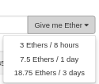

# Steps to install Etherium Wallet in Linux(Ubuntu)

1. Download the Wallet package from the [here](https://github.com/ethereum/mist/releases)
2. Run the following instructions in a Ubuntu Terminal Window

Download the *.deb (Debian) file, e.g. Ethereum-Wallet-linux64-0-9-0.deb

Then do:

> cd ~/Downloads

> sudo dpkg -i Ethereum-Wallet-linux64-0-9-0.deb

# Steps to collect Ether from Ether Faucests

1. visist this faucet [link](https://www.rinkeby.io/#faucet)
2. Tweet about it using this [link](https://twitter.com/intent/tweet?text=Requesting%20faucet%20funds%20into%200x0000000000000000000000000000000000000000%20on%20the%20%23Rinkeby%20%23Ethereum%20test%20network.). Tweet message is as follow : 

> Requesting faucet funds into <0x0000000000000000000000000000000000000000> on the #Rinkeby #Ethereum test network.

3. Replace the address within '<>' with your Etherium Wallet Address. For eaxample,

> Requesting faucet funds into 0x514C24946E90a042F05c17C1xD34622F4 on the #Rinkeby #Ethereum test network.

4. Tweet the above message and then copy the Tweet URL from twitter. For example, 

> https://twitter.com/youruserid/status/110137232243132456

5. Paste the above URL in the given [page](https://www.rinkeby.io/#faucet) and select any of the following options to get the Ether.

# 