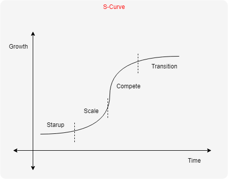

<h1 color='blue'>Entrepreneurship Fundamentals</h1>
 
<h3>Be an Entrepreneur who builds a business and a life for himself as well as for others.</h3>

> The world needs dreamers and the world needs doers. But above all, the world needs dreamers who do.  **- Sarah Ban Breathnach**

## Finding your big idea

#### Are you an entrepreneur?

* Working harder than you've ever worked.
* Coming over you fear of unknown, fear of failure.
* Persuading ability, people need to buy into your ideas
* Setting goals and taking responsibility for your actions
* Learn to create things (Humanity's ultimate yearning is to create something.)

The average age of an entrepreneur is `40`. 
Entrepreneurial activity creates `40%` of the all `new jobs`.

#### High level overview

* Generating and vetting business ideas
* Crafting a business plan and Financial Model
* Building a Team
* Managing stress
* Funding your business

To do something truly new, you need to play where no one else is playing.

#### Finding a problem and looking for its solution

To cover unmet need, to do a job, to find a solution to a problem we need these:

* Emotional element
* Social element
* Functional element

#### Four simple steps for a job to be done

1. Make a list of your dreams.
    > Dreams lead to problems; problems lead to innovation. **- Ed Hoffman** 
    > > Innovation is one of the foundations of Entrepreneurship.  
    
2. Make note of problems that need to be solved.
3. Research available solutions.
4. Ask question - WHY

#### Playing in your own field

Learn to position yourself to take:

* Market risk (recommended for beginners) 
* Competitive risk (Eliminate the competitive risk whenever possible!)
  
Determining Market Risk:

* Is it easy to find information about the market opportunity?
* Is there an established competitor that has an incentive to co-opt(incorporate) your idea?
* Are you going after people that haven't historically been anyone’s customers?
  
> When you take on Market Vs. Competitive Risk
> * Success = 6x Higher
> * Revenue opportunity = 20x Greater

#### Playing to your distinctive strength

> We tend to undervalue what we are and overvalue what we aren't. **- Malcolm Forbes**

> Our strengths clamor for our attention in the most basic way: using them makes you feel strong...you feel invigorated, inquisitive, successful. **- Marcus Buckingham**

Finding your strength (What makes you feel strong?)

  * What do you think about when there's nothing you've to think about?
  * What do others identify as your best skills?
  * Do you've confluence (a set) of skills?  
    > It may be tough to claim to be one of the world's best PHP programmers, Unix Gurus, or apparel e-commerce experts. But there may not be many excellent PHP programmers who are also Unix Gurus and apparel e-commerce domain experts. For the right customer, this is a distinctive strength. **- Ed Weismann Programmer**
    
#### Determining whether you've a business or a hobby

**Moving from amateur to professional**

  1. Gauge interest or demand
  2. Are people willing to pay for what you do?
  3. IRS 3-of-5 test: Have you earned money on this activity in the last 3 to 5 years (including the current year)?
    > Deducting indulgence as business expenses, passion projects - social goods projects etc.   
  4. Show proof you are trying to make money - Business cards, Account Books, Business accounts, License, Marketing expenses

#### Finding you first customer

**Minimum Viable Product(MVP) Approach:** 

Approach is all about collecting the maximum amount of learning about the customers, with the least cost. It's an iterative process.

* Idea collection
* Prototyping
* Data collection
* Analysis
* Learning

**Physical Product Prototype:**

* 3D Printing
* DIY Instructions
* Kickstarter
* ETSY
* Concierge approach

E.g.:

Start with these if you're planning to write a full length book.

* Tweets
* Blogs
* Podcasts
* Short videos

## Starting your business

#### Business Plan

A formal statement defining your business goals, the reasons you think they can be achieved,
and how you are going to achieve them.

#### Types of Business Plans

* Elevator Pitch
* Pitch Deck
* Written Proposal (Internal detailed guidelines of the plan)

#### Business Plan Resources

* What will you sell?
* What problems will you solve?
* What will you charge?
* Who will buy your product?
* How will people find about you?
* How will you make the product / provide the service?
* What will your product/service cost?
* Do you have competitors?
* Why will customers prefer you?
* Are you disrupting another company?
* Does this business play to your strengths?
* What are some obstacles/challenges you're going to face?
* By when will you start?

Note: You may need to do more research and find the deep intricacies.

Business plan is all about:
 
1. Idea generation
2. Prototyping
3. Data Collection
4. Analysis
5. Learning
 
## Setting Prices
 
#### Considerations for setting Prices
 
* Ask your customers what they pay for a similar product or service?
* Do they buy online or in store?
* A' La carte or All in one?
* B2B or B2C, Outside approval?
 
**Benchmark against competitors **

* If your product is better, charge more.
* If your product has fewer features, charge less.

* Err on side of pricing too high
* Experiment with prices (A/B Test, e.g., Amazon pricing)
* If your product = `$ 100` of value then charge `$ 30` - `$ 40`.
* Payments promote satisfaction (subscription model)
* Consider what you need to charge to make more money.
* Pricing shapes customer perception - it is a cue to customer about product value.

#### Deciding between Online Vs. Brick & Mortar

**Start online if at all possible:** 

* Startup and overhead costs are significantly lower.
* Think of your online presence as your minimum viable product.

**Deciding on Brick & Mortar:** A store, office, or other physical space customers can walk into during business hours.

1. Choose a specialty, offering exclusive items
2. Curate your inventory
3. Place emphasis on non-commoditized items, providing additional value
4. Have a great website, online presence 
5. Emphasize exclusivity 
6. Higher superb customer facing employees - enthusiastic and knowledgeable

#### Building a Financial Model

1. Revenue: `Price * Volume`, It should be data driven or some realistic, quantitative and logical.
2. Calculate your costs 
    * Cost to make and market your product
    * Employees
    * Office Space
    * Cost of acquiring customers
3. Solve for profit / loss (Being patient for growth, impatient for profit!)
    * Sell more at lower price?
    * Less at higher price?
    * Lower costs?
4. Know your burn rate
    * Know your runaway: how long you've to run your business until you need to shut down or innovate.

Keep a financial model to run your business as it's said follow the money/know your numbers to have a clear idea of your business.  
> Remember! for an entrepreneur cash really is kin.

#### Deciding on a Legal Structure

How profitable? how protected? how readily you can raise capital? - all these depends on your legal structure of the business.

**Five basic legal structures: **

1. Sole proprietorship: Where one person legally makes up the whole company.
    * No setup costs
    * Complete control
    * Tax efficient
    * Pass-through taxation
    e.g., Landscaping, computer support, day-care, contractors etc.
2. Limited liability company (LLC): Where one person legally makes up the whole company.
    * Limited liability, personal assets are protected
    * Creditors can't come after your house
    * Pass-through taxation
    * Issue stock to raise capitals
3. Partnership: partnership between two or more person/entities 
    * Less expensive than an LLC
    * Pass-through taxation
    * Partners are responsible for business obligations and debts
4. Subchapter S (S Corp): 
    * Provides limited liability 
    * Pass-through taxation
    * Tax rate is lower than LLC
    * Only wages are subject to tax
    * If a shareholder sells, the S Corp doesn't dissolve
    * More legal obligations
5. Sub-Chapter C (C Corp):
    * Structured to raise venture capital or for an Initial Public Offering (IPO)
    * Independent entity separate from the owners 
    * No personal assets at risk
    * Double taxation

> Avoid mixing business and personal accounts

> Consult with an `Accountant` and a `Lawyer` to understand the financial & legal obligations and maintain the business licenses and approvals properly.

## Intellectual Property (IP)

1. Trade Secrets: Confidential information that gives a business its competitive edge. E.g., 
    * Business Plans
    * Customer Lists
    * Pricing Designs 
    * Procedures

**Non-disclosure Agreement(NDA): ** An agreement between two parties that creates a confidential relationship, protecting proprietary information or trade secrets.

2. Trademark: Names, Words, Slogans, Pictures, Graphics, or Sounds that distinguish a product.

**Checking for a Trademark:**

* Domain registrations
* Google Search
* Trademark Electronic Search System (TESS)

3. Copyright: Protection that extends to original works of authorship fixed in a tangible medium of expression. 
4. Patent: Set of exclusive rights granted to an inventor in exchange for detailed public disclosure of an invention.

> Patent Trade Offices (PTO): File a provisional patent application before filing the formal patent application. 

5. Right of Publicity: The right of an individual to keep one's image and likeness from being commercially exploited without permission or contractual compensation. 

> Intellectual property fundamentals - Dana Robinson 

#### Gearing up operationally

Prepare operational checklist for your plan.

* What are the processes and procedures you'll use to produce your product or provided your service?
* What inputs do you need, whether physical goods or information?
* How will you source those materials?
* Who are your suppliers or vendors?
* How you'll chose them?

Managing your inventory:

* If you have physical goods, where will you store them?
* Will you build to order or build to stock?
* What are the logistics involved to get the product or service to the customer?
* What are your delivery channels?
* Will you deliver the products yourself or will you outsource?
* If your delivering a service, or information, how quickly will that delivery happen?

Customer Service:

* How do you need to operate your business so that they actually do prefer you?
* What are your expectations around service?

> Remember to FOCUS not only on the WHY but the HOW.

> MARKETING is what we say we are. OPERATIONS is about making our MARKETING true!

#### Bootstrapping your business

* What if you are short on money?
* What if you are short on time?
* What if you lack expertise?

> Dare, Dream, Do: Remarkable things happen when you dare to dream. **- Whitney Johnson**

## Building a TEAM

### Deciding a co-founder

#### Going SOLO

* Have enough of what you need
* Want to retain 100% of the equity and decision making
* Like to work alone

#### Deciding factors

1. Look at the relationship of the co-founders (if they've worked together previously etc., and built trust over time)
2. Think carefully about the respective roles
3. Think about how to divide the spoils
    * Dynamic Equity Split: Dividing equity based on phase weighting.
        * Vesting Equity: Distributed equity which requires founders to earn stakes based on time and milestones
4. Consider hiring a lawyer to protect your interest

> NOTE: Trust building among co-founders is of paramount importance.

> NOTE: Working with co-founders is similar to marriage. Even at times it could be more difficult to dissolve a business partnership than dissolving a marriage.

### Hiring the right people

#### Hiring

1. Chalk out what you really need a hire to do. Ensure skillsets are _complementary_ and not _redundant_.
2. _Team Diagnostic Tools_: Use these tools to analyze your team ability.
   * Team ability
   * Plumb
3. Try before you buy - Hire for expertise, not credentials.

> "The 'experienced' candidate might have a resume which, on paper, gives you a lot of confidence, but you've to be open to the possibility that it might be the candidate with less experience, or with an unconventional background, who is the right person for the role." **-Francis Pedraza (CEO, Founder of Everest) **

4. Think of your employees as _assets_ and not _cost centers_.

> "Few things can help an individual more than to place responsibility on him, and to let him know that you trust him." **-Booker T. Washington**

### Getting the right advisers onboard

#### Advisory Board

A committee of typically `4-10` individuals who lend their expertise, networks, and cachet to the organization, without taking on the fiduciary and legal responsibilities of a governing board.

#### Putting together a Board

1. Identify what you don't have but need to take your organization to the next level. e.g.,
    * Strategic Partnerships
    * Improving Customer Acquisition 
    * Scaling operationally
    * Driving Down Cost
    * Personifying your Target Market
2. Be aware of your personal bias. 
3. Only bring on people you trust.
4. Find people who love your company, who can advocate for your company

#### Make specific asks

* I would like to know I can reach out to you for advice and you will respond within 48 hours.
* I would like you to review the company financials once a Quarter and make suggestions for KPIs (Key Performance Indicators).
* Review our RFP (Request for a proposal) for a new technology platform.
* Make recommendation around _Customer Acquisition_
* Refine our _Investor Pitch_
* Connect us with _Media Outlets_
* Introduce us to _Perspective Investors_

#### Compensating Board Members

* With your product
* With Cash
* With Equities - 25 to 50 basis points (100 Basis point = 1% of the equity)

### Tapping into networks of expertise

#### Expanding Your Network

* Create an elevator pitch (30s elevator pitch style)
* Start with family and friends (Build strong ties in your inner circle)
* Use weak ties (Build strong ties in your outer circle (LinkedIn))
* Ask the right person for the right thing
* Make networking transactional

# Marketing Your Business

### Telling your story

1. Answer the question "Why"?
    * Why did you start your company?
    * Why this product or service?
    * Why you're only doing this?
    * Why do the customers buy your product?
    * Why employees like to work in your company?
2. Make your message memorable
    * Use familiar slogans in fresh ways
    * Startle with specifics
3. Make it easy for people to share your story
    * Use catchphrases, (illustrations, rhyming words)
    * Craft creative and enjoyable names
    * Use videos and images

### Building A Website

**Elements of a good website**

1. Usability
    * Simple menu
    * Clear Text
    * Easy navigation
    * Browser Independent
    * Device Independent    
2. Structure
    * Create a blueprint
    * Looks and layouts
    * Menu type
    * Titles and Logo
    * Text and Video placement
    * Consistent brand, color, fonts
3. Optimization
    * Lead generation and conversion
    * HubSpot Marketing Grader (measure and analyze your marketing efforts as checklist)

**Tools for building your own site**

* WordPress
* Squarespace
* Shopify
* Big Cartel

**Outsourcing Web Designer and Web Developer**

***Web Designer***: Creates the look if a site from mock-ups to final hand-off to a developer.
***Web Developer***: Takes a vision for a site and writes code to make it function correctly.

***NOTE***: Your website is a calling card as well as a point of sale so get it right. You need to keep in mind about Hosting Options, Domain Registrations, Logo, Design and Marketing elements previously used etc.

### Chasing the customers until you've them

**Marketing Tools**

* Blog
* Social Media
* Lead Generation
* Brand Ambassadors
* Hire someone to manage your online advertising (ad campaigns)
    * Yahoo Ads
    * Google Ads
    * Facebook Ads
* Online Affiliate Programs
    * Commission Junction
    * Pepperjam
* Contact smaller media outlets (smaller ones, bloggers, instagrammars and youtubers)
* Choose fee-for-service-based Ad agencies

### Serving Your Customers

* Do you love your customers?

> You love your customers because they pay you money. OR You love your customers, and sometime there is a transaction.

* Showing Customer Love
    * Find the "yes" in a request
    * Hire good employees
    * Be responsive 
    * Learn to apologize
    * Follow Up

> 70% - 80% of the new customers are generated from word of mouth from the 5% of the existing delighted customers. This also shows that your delighted customers could be ambassadors for your brand.

### Refining Your Business Ideas

**Examining Sales**

* Where are your customers coming from?
* Are you solving the problem you thought you would solve?
* Are you selling more or less than you thought you would?
* What about the price point?

**Examining Metrics**

* What percentage of visitors to your site are returning visitors?
* What percentage of visitors are converting into leads?
* Is this percentage increasing or decreasing?

> Check for more: Entrepreneurship Fundamentals Handout.pdf 

**COHORT ANALYSIS**

* Dividing up customers into related groups, rather than viewing them as one unit. 
* Clustering customers based on daily, monthly or Quarterly basis who are buying your product.

**Examining Costs**

* Are costs higher or lower than expected?
* What about the cost of customer acquisition?
* Which source of customer is most effective?
* Which will be easiest to scale?
* Is the cost of customer acquisition increasing or decreasing?

**Examining Relationships**

* How are you working together?
* Are your roles and responsibilities stable or are they shifting?
* Equity Adjustment and any change is required?

**Examining Employees**

* Are you in compliance with the Local Labor Laws?
* Is everyone who should be classified as an employee classified as such?
* Are your employees happy?
* Is their ability to serve the customer improving?
* Are they improving the bottom-line?
* If someone isn't working, are you dismissing the person quickly and appropriately?

**Examining Spending**

* How is your burn rate changing?
* What adjustments are required?

**Examining Self (Self - Reflection) **

* Are you still playing to your strengths?
* Are you still enjoying being an entrepreneur?

### Becoming a Thought Leader

***Thought Leader***: A person who is on the cutting edge of the field.

**Reason to be a Thought Leader**

* You beat the competition.
* A tool for lead generation.

1. Begin with genesis story 
    * Why your product?
    * Why your company?
    * Why you?
2. Start Blogging
    * Low cost way of expressing your views and ideas
    * Try Podcast, SlideShare, YouTube Channels as alternatives
     > Analyze ROI (Return on Investment) to prioritize accordingly
3. Pitch for Online Publications
    * LinkedIn
    * Local Paper
    * Local Websites
    * Huffington Post
    * Medium
4. Speak at conferences
    * Keynote
    * Panelist

> Ability to persuade is the most important quality one can have...always remember that.

# Scaling Your Business

### Using the Right Metrics

**Pirate Metrics - AARRR**

* Acquisition
    * How many people visist your store or site? (Google Analytics)
    * _Bounce Rate_: Percentage of customer who visist your store/site, but leave without completing a transaction. 
    * Ideally 30% of all visistors
* Activation
    * Stay more than 10 sec
    * Read 2+ pages
    * Ideally 50% of all visistors
    * Ideally 20% click
* Retention
    * A signal that a customer plans to come back, by providing you contact information.
    * Should be at least 10% of all visitors
    * Start by interviewing (Potential) Customers 
* Referral
    * The customers who recommend you to one or more person
    * Ideally 1% of all visitors refer one other person    
* Revenue
    * The amount of money customers are spending with you
    * Conversion rate from visitors to customer should be at least 1% to 2%

### Learning to Negotiate

**Negotiating Tips**

* Signal when you're transacting
   > "This is what my company does. Here's the problems we solve for our customers."
* Learn to sit on both sides of the table
   > Look for the win-win situation
* Avoid ultimatums (Don't Do Drama)
* Consider the whole deal, be creative to strike a deal
* Look to the horizon
* Watch for wanting a deal too much, don't decide emotionally as it could be vulnerable

### Minding Your Cash

> Thirty percent of the businesses declaring bankrupty cite problems with the Financial Structure of the Company.

**Managing Money**

* See how much cash you've once a week. 
    * _Cash on hand_: Checking, Savings balances of accounts
    * _Recievables_: Money earned but yet too be collected
* Do a 13-Week cash flow forecast (Quarterly Forecast)
    * Expected in-flows
    * Expected Out-flows
    * Watchout for confusing revenue with cash flow
    * Anticipate unexpected expenses
* Close Your Books
    * Hard Close and Soft Close (Hire an accountant)
    * Categorize your cash flows

### Put Failure in its Place

> "An Important Part Of Disruption Is Having The Nerve To Take On A Really Big Failure." ***Ken Gabriel (Former DARPA Official)***

**Dealing With Failure**

* Acknowledge the emotional effect failure has on you.
* Ditch the Shame, It may drown you and your dreams
* Ask the question : What valuable truth did you discovered about the present and future prospects of your start-up, by failing?

> "Learning is the essential unit of progress for start-ups". ***Eric Ries, Entrepreneur, Author - The Lean Startup***

> "Learn to invest not only on your mind but your heart too."

### Managing Stress

* Give yourself a break 
> Approach for your business as a Marathon and not as Sprint! RUN-WALK-RUN approach, build stamina, increase your pace
* Take care of your body, excercise, eat good food, sleep early and wakeup early
* Maintain connections - family, friends, colleagues
* Don't underestimate your mental power

### Documenting Processes

Document critical tasks your company and employees do.

* Start with just one process
    * One with reasonably in good working order. E.g., accounting, paying invoices, retaining customers etc.
* Interview the people involved, ask them to show and tell how they do what they do.
    * Stepwise instructions
    * Checklists
    * Referred docs.
* Create single page Visual representation of the process (Role Functions/Processes)
* Engage in an IF-THEN exercise
* Document the process from begining to the end
* Review the document with all impacted parties

# Funding Growth

### Understanding Capital Options

**Bootstrapping**: It will allow you to get the most out of your plan.

* Working out of your home
* Using low-cost services
* Leasing rather than buying
* Delaying Compensation
* Using Temporary Personnel
* Bartering

**Start-up Financing: Debt**

* Loans from friends or family,
* Credit Card Debt
* Personal Loans

**Start-up Financing: Equity**

Types of Equity Investors:
* Friends
* Family
* Angel Investors
* High-net-worht Individuals
* Venture Capitalists

**Accelerators**

Investors who typically take 5%-8% equity in exchange for a small amount of start-up cash as mentorship.

**Start-up Financing: Convertible Debt**

A Hybrid between debt and equity.

### Crowdfunding 

Funds acquired through small contributions from many different people in order to finance a particular project.

* Use the campaign to fund a very specific project or product
* Limit how much money you try to raise
* Make it a campaign, well thoughtout marketing and grassroot strategy.
* Tend to the campaign daily
* Expect to work hard to meet your target
* Ensure you can comply with the fine print 
(Incase of violations it could lead to termination of campaign, freezing of funds and filing of law suite for your caompany)

> A great testing ground for your product and team, a graduated form of bootstrapping
> Donner based or reward based crowdfunding can help you raise funds without debt and without giving up ownership of your company

### Pitching Investors

**Financing Tips**

* Prepare an elevator speech that you can deliver in under a minute to anyone you need.
> ***Elevator speech***: Explain what problem you solve, Why you're the one to solve it and Why this will make money for investors
* Build an Angelist Profile, It allows investors to know about you and to you about them. Who you'r and what you do makes the investor easier to find you.
* Create a list of investors you'd like to meet with.
* Scane Your Networks
* Do Your Homework (Know about Investors to Pitch for them)
* Focus on Storytelling (Progress in the form of numbers, competative advantage etc.)

### Valuing Your Company

* Your business is only worth what an investor is willing to pay.
* ***Berkus Method***
    * Sound ideas are worht $500,000
    * Prototype adds $500,000
    * Quality Management Team adds $500,000
    * Strategic Relationships add $500,000
* ***Bill Payne's Scorecard Methodology***
    * Baseline number of $1.5 million, and adjust valuation based on:
        * Management Team
        * Size of Opportunity
        * Competition
> Check for more: Entrepreneurship Fundamentals Handout.pdf 
* ***Bill Sahlman's Venture Capital Method***
    * Business revenue at $20 million
    * Worth 2x revenue incase of sale (= $40 million [Terminal Value])
    * Divide $40 million by return required
    * Investors suppose need 20x return on the invested money ([Anticipated return])
    * So, Company Valuation = Terminal value / Anticipated return, i.e., $40/20 = $2 million 

### Reaching a Deal

**Term Sheet**

Non-binding document that identifies:
    * How much of the company the investors will own and at what price?
    * How much stock needs to be set aside to attract talent?
    * What kind of rights the investor has if the company is sold?
    * Who will be on the Board of Directors? &
    * When the deal closes?

* As you negotiate, keep the investors' perspective in mind.
* Stockholders typically get 1x or All their money back before common holders get anything.
* As the investors conduct due deligence on you so do you've to conduct due deligence on them.
    * Does the investor understand your business and industry?
    * Do they have enough money so that if you need to raise more capital, they can participate?
     > cehck [https://www.funded.com/](https://www.funded.com/)

# Conclusion

### Preparing Mentally

### Staying True to Your Vision

**Create a Business Plan**

### Balancing Entrepreneurship and Life

If you want a successful business then show up to your life, family and work everyday.
Be an Entrepreneur who builds a business and a life for himself as well as for others.

***Equal Odds Rule***: The odds of 'winning' in any given situation are correlated to the amount of time participating in the activity.

> The odds of writing a groundbreaking research paper are correlated to how many papers the scientist has written.

# Excercises

THE END

